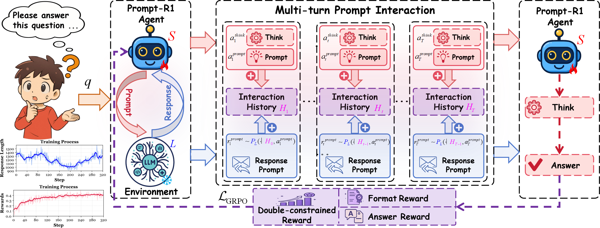
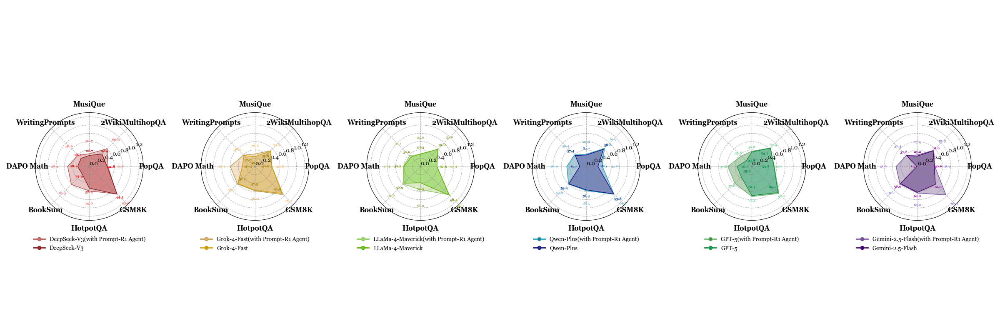

# Prompt-R1: Interact with LLMs more effectively on behalf of humans

Prompt-R1: Collaborative Automatic Prompting Framework via End-to-end Reinforcement Learning [[paper](https://arxiv.org/abs/2507.21892)]


## Overview

<div align="center">
  
</div>

**Prompt-R1** has addressed a critical challenge in interacting with large language models (LLMs)—the inability of users to provide accurate and effective interaction prompts for complex tasks. **Prompt-R1** is an **end-to-end reinforcement learning (RL)** framework that enhances the performance of LLMs by facilitating **collaborative automatic prompting** between a small-scale LLM and a large-scale LLM. **Prompt-R1**, through **multi-turn prompt interaction**, significantly improves the generation quality and reasoning accuracy of large-scale LLMs, enabling better task-solving performance without requiring user expertise in prompt formulation.


<div align="center">
  
</div>

By integrating **collaborative prompting** and **reinforcement learning**, **Prompt-R1** offers a **plug-and-play framework** that supports both **inference** and **training** with **various large-scale LLMs** as the environment. 

## Experimental Results
**Results of Different Large language models:**
<div align="center">
  
</div>


## Prompt-R1 Implementation

### Install Environment
```bash
conda create -n promptr1 python==3.12 -y
conda activate promptr1
cd verl
pip3 install -e .
pip3 install vllm==0.8.3
pip3 install flash-attn==2.7.4.post1  # Download: https://github.com/Dao-AILab/flash-attention/releases
pip3 install FlagEmbedding faiss-cpu
pip install debugpy==1.8.0 "ray[default]" debugpy
```

### Dataset Preparation
>Our datasets are in:
```bash
Training Dataset: dataset\train_data
Evaluation Dataset: dataset\eval_data
```

### Quick Start: Prompt-R1 
#### To use closed source LLM, modify promptr1_agent\tool\tools\LLM-toolpy:
```bash
API_KEY = "your_api_key"
MODEL = "model_name"
BASE_URL = "url"
```

```bash
nohup bash run_prompt-R1.sh > Prompt-R1_training.out &
```

### Deploy an Open-Source Model Locally
#### 1. Configure the agent to call your local API
>Edit agent_r1/tool/tools/search_tool.py and set the local API endpoint and model name
```bash
base_url = "http://<SERVER_IP>:8000/v1"
```

#### 2. Install vLLM and dependencies
```bash
# Create environment
conda create -n vllmapi python=3.12 -y
conda activate vllmapi
# Install dependencies
pip install transformers accelerate huggingface_hub
pip install vllm
```

#### 3. Start the OpenAI-compatible server
>Set GPUs and tensor parallelism according to your hardware.
```bash
CUDA_VISIBLE_DEVICES=0,1 \ 
python -m vllm.entrypoints.openai.api_server \
  --model /data/yichao/wenjin/models/gpt-oss-20b \
  --port 8000 \
  --tensor-parallel-size 2 \
#   --gpu-memory-utilization 0.70 \
#   --dtype bfloat16 \
#   --max-model-len 32768 \
#   --max-num-seqs 32
nohup python -m vllm.entrypoints.openai.api_server     --model gpt-oss-20b     --tensor-parallel-size 8     --host 0.0.0.0     --port 8000 > api.out 2>&1 &
```


### Evaluation
#### 1.Edit model_merge.sh and set the paths
```bash
export CHECKPOINT_DIR='./checkpoints/Prompt-R1/grpo-qwen2.5-1.5b-instruct/global_step_320/actor'
export HF_MODEL_PATH='./Qwen/Qwen2.5-1.5B-Instruct'
export TARGET_DIR='./merge_model/Qwen2.5-1.5B-Instruct'
```

#### 2.Edit vllm_serve.sh and point to the merged folder
```bash
export MODEL_NAME='./merge_model/Qwen2.5-1.5B-Instruct'
```

#### 3.Single-Example Inference
```bash
python inference.py
```

#### 4.Batch inference & scoring
```bash
python batch_inference.py
python eval_scores.py
```

## BibTex

If you find this work is helpful for your research, please cite:

```bibtex
@misc{luo2025graphr1,
      title={Graph-R1: Towards Agentic GraphRAG Framework via End-to-end Reinforcement Learning}, 
      author={Haoran Luo and Haihong E and Guanting Chen and Qika Lin and Yikai Guo and Fangzhi Xu and Zemin Kuang and Meina Song and Xiaobao Wu and Yifan Zhu and Luu Anh Tuan},
      year={2025},
      eprint={2507.21892},
      archivePrefix={arXiv},
      primaryClass={cs.CL},
      url={https://arxiv.org/abs/2507.21892}, 
}
```

For further questions, please contact: wenjinliu23@outlook.com.

## Acknowledgement

This repo benefits from [Agent-R1](https://github.com/0russwest0/Agent-R1), [HyperGraphRAG](https://github.com/LHRLAB/HyperGraphRAG), [FlashRAG](https://github.com/RUC-NLPIR/FlashRAG), [LightRAG](https://github.com/HKUDS/LightRAG), [HippoRAG2](https://github.com/OSU-NLP-Group/HippoRAG), [R1-Searcher](https://github.com/RUCAIBox/R1-Searcher) and [Search-R1](https://github.com/RUCAIBox/R1-Searcher). Thanks for their wonderful works.